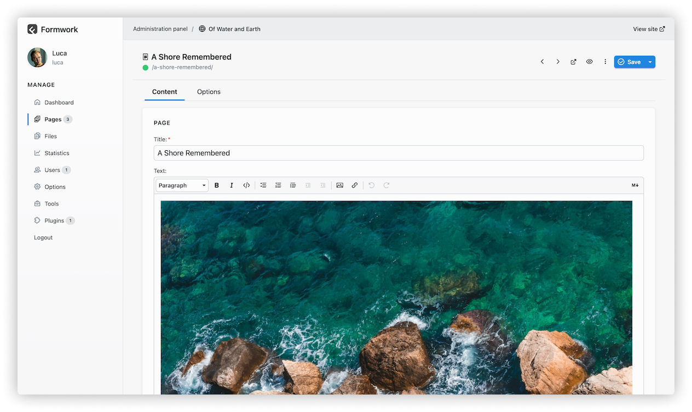

#  Formwork

[](#requirements)
[](https://github.com/phpstan/phpstan)
[](https://github.com/getformwork/formwork/actions/workflows/check.yaml)
[](https://github.com/getformwork/formwork/releases/latest)
[](https://github.com/getformwork/formwork/releases)
[](https://packagist.org/packages/getformwork/formwork)

🏗 Formwork is a simple, fast and flexible flat-file CMS that allows you to create and manage websites without the need for a database.

## Features

- 🗂️ File-based structure
- 📝 Markdown + YAML for your content
- 🪗 Flexible structured content
- 💡 Intuitive API
- 🛠️ Built-in administration panel



## Requirements

- PHP **8.3** or higher
- PHP extensions `dom`, `exif`, `fileinfo`, `filter`, `gd`, `libxml`, `mbstring`, `openssl`, `session`, `tokenizer`, `zip`, `zlib`

## Installing

### From GitHub releases

You can download a ready-to-use `.zip` archive from [GitHub releases page](https://github.com/getformwork/formwork/releases) and just extract it in the webroot of your server.

### With Composer

If you prefer to install the latest stable release of Formwork with [Composer](https://getcomposer.org/) you can use this command:

```shell
composer create-project getformwork/formwork
```

Composer will create a `formwork` folder with a fresh ready-to-use Formwork installation.

To use the administration panel you need to build the [assets](#building-administration-panel-assets-with-yarn).

### Cloning from GitHub

If you want to get the currently worked master version, you can clone the GitHub repository and then install the dependencies with Composer.

1. Clone the repository in your webroot:

```shell
git clone https://github.com/getformwork/formwork.git
```

2. Navigate to `formwork` folder and install the dependencies:

```shell
cd formwork
composer install
```

3. Build the administration panel [assets](#building-administration-panel-assets-with-yarn).

### Building administration panel assets with pnpm

After installing with Composer or cloning from GitHub, you need to build the panel assets with [pnpm](https://pnpm.io/) by running the following commands:

```shell
cd panel
pnpm install
pnpm build
```

## Running Formwork server

You can test Formwork right away with the `serve` command, a customized wrapper of the [PHP Built-in web server](https://www.php.net/manual/en/features.commandline.webserver.php).

> [!IMPORTANT]
> As with PHP CLI web server, Formwork server is intended for **testing purposes** and not for production environments.

Navigate to the `formwork` folder and run the following command:

```shell
php bin/serve
```

If you prefer you can run the Formwork server through Composer:

```shell
composer serve
```
